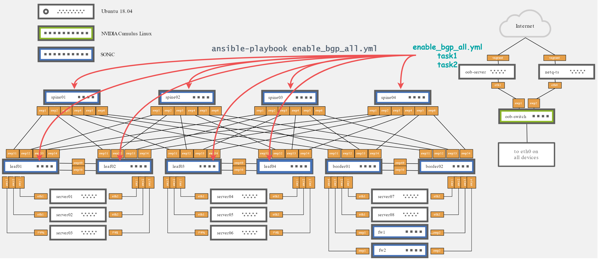

# sonic_ansible_playbooks
ansible playbooks to automate sonic networks configuration

### enable_bgp_all
this playbook enables bgp on all interfaces of the spine and leaf nodes, it has 2 tasks

1. enabling bgp
2. saving the running config

by running `ansible-playbook playbooks/enable_bgp_all.yml` the tasks are ran on all the hosts of category `spine` and `leaf` (see the [hosts file](hosts))

if there was no routing setup beforehand, connectivity should be restored after running the playbook.
the typicall output of a sucessfull execution is captured [here](typical_output/enable_bgp_all).

